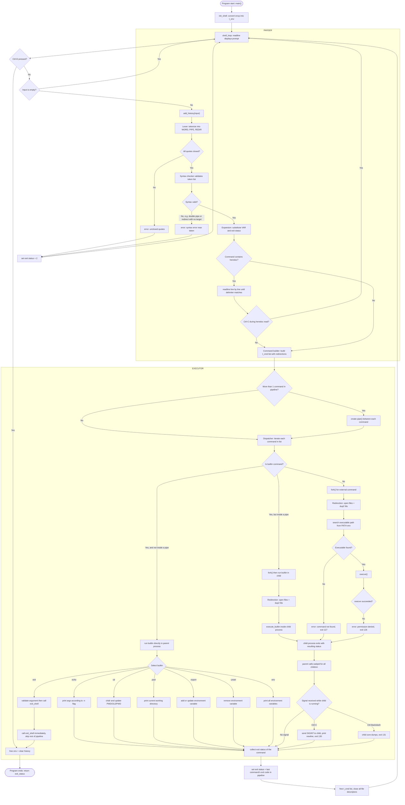
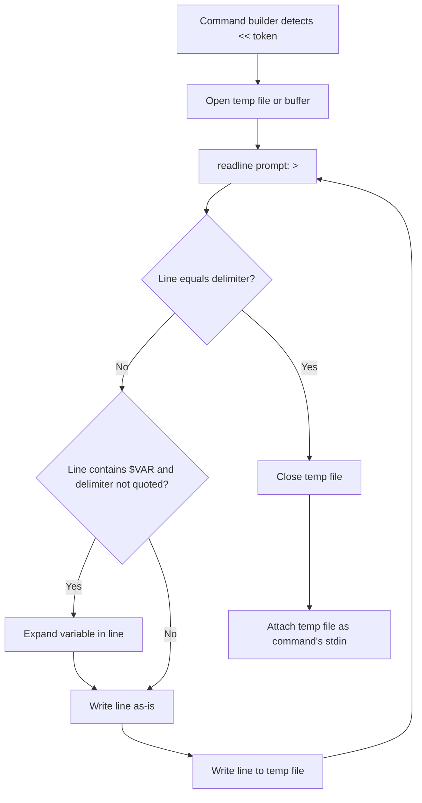
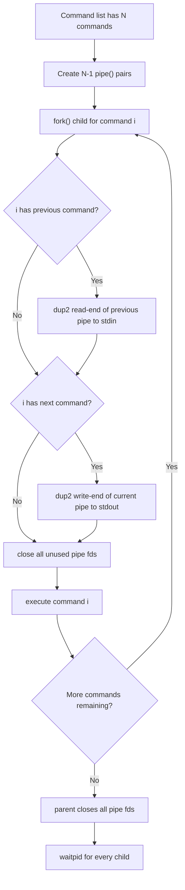

# Minishell — Programming Flow Chart

This document contains a detailed Mermaid flowchart describing the full execution flow of the minishell project, from program start to command execution and back to the prompt loop.

GitHub renders Mermaid diagrams automatically inside `.md` files — no extra tooling needed. You can also paste the code block into [mermaid.live](https://mermaid.live) to preview or export it as an image.

---

## Full Flow

---

## Diagram Structure Explained

### Subgraph ownership (maps to team split)

| Section | Owner | Covers |
|---|---|---|
| Outside any subgraph | Shared (Core) | readline, init, cleanup — start and end point of every loop iteration |
| `ParserPart` | Person 1 | Lexer through Command builder |
| `ExecutorPart` | Person 1 (builtins only) + Person 2 (everything else) | Dispatcher, pipes, redirection, path search, signals |

### Key decision points (diamonds)

1. **`SyntaxValid`** — if syntax is invalid, the turn ends immediately without ever reaching the Executor.
2. **`IsBuiltin`** — the handoff point where Parser output determines which execution path the Executor takes.
3. **`SignalDuring`** — where signal handling interrupts the parent while it waits on a running child process.

### Loop behavior

Every path — success, error, or signal interruption — loops back to `Prompt`, except two terminal cases:
- `Ctrl-D` at the prompt → `CleanExit` → `Exit`
- Builtin `exit` being called → `ExitShellCall` → `CleanExit` → `Exit`

### Exit code reference embedded in the flow

| Path | Exit code |
|---|---|
| Syntax or quote error | 2 |
| Command not found | 127 |
| Permission denied | 126 |
| Killed by `Ctrl-C` (SIGINT) | 130 |
| Killed by `Ctrl-\` (SIGQUIT) | 131 |
| Normal completion | Exit code of last command in pipeline |

---

## Sub-flow: Heredoc (zoomed in)

## Sub-flow: Pipe Setup (zoomed in)

